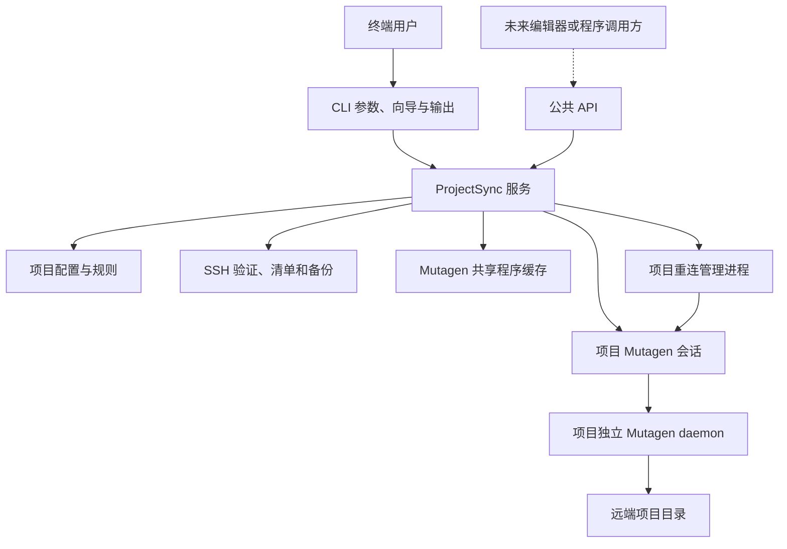
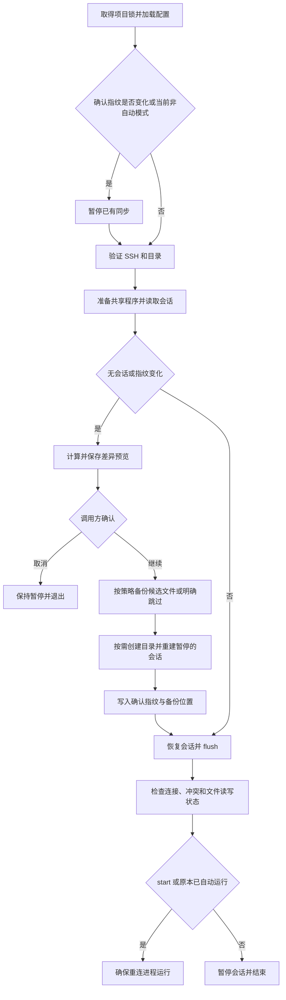

# 架构与运行流程

## 分层

实线表示当前实现；未来编辑器入口尚未实现。代码已有模块边界，但公共数据结构和依赖注入接口仍是 0.1.0 内部演进状态。

## 模块地图

| 文件 | 职责 |
| --- | --- |
| [bin/devsync.mjs](../bin/devsync.mjs) | 可执行入口 |
| [src/cli.mjs](../src/cli.mjs) | 参数解析、信号处理、命令分发、文本/JSON 输出 |
| [src/terminal-ui.mjs](../src/terminal-ui.mjs) | Clack 向导、范围/差异展示、纯文本回退、阶段进度与终端清理 |
| [src/configure.mjs](../src/configure.mjs) | 配置问题与分项重试，输入函数由调用方提供 |
| [src/service.mjs](../src/service.mjs) | `ProjectSync`，编排确认、备份、会话与后台状态 |
| [src/status.mjs](../src/status.mjs) | 状态契约、同步/管理进程分离、诊断与终端输出 |
| [src/project.mjs](../src/project.mjs) | 项目真实路径、配置加载、私有目录权限与保存 |
| [src/rules.mjs](../src/rules.mjs) | 规则校验、匹配与 Mutagen 排除参数 |
| [src/connection.mjs](../src/connection.mjs) | SSH 别名、有效默认值、连通性、远端依赖及权限检查 |
| [src/remote.mjs](../src/remote.mjs) | SSH 调用、远端清单、备份与目录创建 |
| [src/backup.mjs](../src/backup.mjs) | 备份策略校验、已确认范围比较和备份归属判定 |
| [src/askpass.cjs](../src/askpass.cjs) | 给 OpenSSH 提供与所选目标匹配的草稿密码 |
| [src/session.mjs](../src/session.mjs) | Mutagen 参数、会话命令和配置指纹 |
| [src/ssh-transport.mjs](../src/ssh-transport.mjs) | 私钥路径规范化、共享认证参数和项目独立 SSH/SCP 启动脚本 |
| [src/worker.mjs](../src/worker.mjs) | 后台重连进程的启动、退出与重试 |
| [src/install.mjs](../src/install.mjs) | 下载、发行包校验、解压、迁移与缓存启用 |
| [src/cache.mjs](../src/cache.mjs) | 用户缓存路径与跨进程锁 |
| [src/releases.json](../src/releases.json) | 固定发行版本和各平台 SHA-256 |
| [src/core.mjs](../src/core.mjs) | 子进程、JSON 文件、哈希、清单差异及通用校验 |
| [src/errors.mjs](../src/errors.mjs) | `SyncError` 与错误对象转换 |
| [src/progress.mjs](../src/progress.mjs) | 下载进度解析与终端绘制 |
| [src/index.mjs](../src/index.mjs) | 包的公共导出 |

## 配置流程

`init` 和 `config` 调用相同的服务流程：取得项目锁 → 停止重连管理进程并暂停已有会话 → 加载旧值和规则 → 收集输入并验证 → 展示范围 → 确认 → 保存。

公开规则不存在时创建 `sync.config.json`，并给 `.gitignore` 补充 `.sync/`。已有规则文件保留。连接和密码分别写入私有文件；`config.json` 写入失败时尝试恢复旧认证文件。这不是跨文件事务，异常路径的进一步覆盖见[优化候选](roadmap.md)。

连接探测使用临时私有凭据目录，不提前覆盖正式配置。OpenSSH 展开别名后，askpass 仅接受所选主机或展开后主机的密码提示。探测结束清理临时目录。

配置收集回调现在接收服务提供的 `checks.probe` / `checks.checkPath`。成功检查在本次调用的内存中记录配置与认证摘要；SSH 验证不依赖目标路径，目录验证包含完整配置。保存前仅补做缺失或配置已变化的检查，失败会撤销同一组参数的旧检查结果。未使用这些检查的 API 调用方仍由服务完整验证，不接受外部传入的“已验证”标志。验证记录不写入文件。

CLI 将结构化输入、选择和阶段回调交给 `terminal-ui.mjs`，配置流程与 `ProjectSync` 不导入终端组件。向导结束时恢复 raw mode 和光标；阶段进度使用现有可清理的 Progress 实现，信号交给 CLI 取消子进程并释放项目锁。JSON 模式抑制全部向导/阶段输出，纯文本终端使用序号选择。`@clack/prompts` 固定为兼容 Node.js 18 的版本并随程序包分发。

## 同步流程

备份使用独立的 `backupScope` 比较本地来源、远端目标和排除/环境文件规则。首次接管或目标变化选择全部受影响文件；同一目标的规则扩展只选择新纳入范围的受影响文件。认证/轮询变更可重建会话，但不会因此重复备份。策略关闭、范围未扩大或无受影响文件时跳过估算和归档。默认保留数量为 3，交互确认也可明确跳过一次。

文件大小估算只 stat 候选路径。压缩包校验成功后，路径登记到本地 `.sync/backups.json`；归档名包含本地项目标识和随机标识。同步成功后才执行保留策略，删除候选必须同时出现在登记中、匹配项目命名空间和当前目标。要保留的文件缺失、候选被换为符号链接或目录时停止清理。清理失败只产生警告，保留待清理标记以便重试。旧包和未登记文件不参与自动清理。

指纹当前包含本地根目录、远端配置、`identityFile`、同步模式、轮询策略和项目规则，不包含 Mutagen 发行版本。显式私钥项目还包含规范化私钥路径、传输适配版本及是否使用密码认证；旧显式私钥会话需重新确认，普通会话的原指纹保持不变。

Mutagen 0.18.1 的 [SSH 传输](https://mutagen.io/documentation/transports/ssh/)通过 SSH 连接和 SCP 安装 agent，`MUTAGEN_SSH_PATH` 在 daemon 中生效。显式私钥项目在 macOS/Linux 生成只包含程序路径和选项的 SSH/SCP 启动脚本，两者复用直接 SSH 的认证选项。确认后创建新脚本，停止旧 daemon 并等待其 socket 移除，再保存 `.sync/ssh.json` 并创建暂停会话。新的 CLI 或后台 worker 从该记录恢复启动路径；草稿配置不会改变运行中的认证参数。Windows 显式私钥配置在验证时拒绝，使用 SSH config 替代。

`preview` 直接读取清单，不需要安装 Mutagen；有已有会话时通过保存的程序路径将其暂停。它会写本地预览与控制状态，所以“只读”仅指远端源码。

## 三处规则一致性

同一份已规范化规则用于：

1. 本地目录遍历与哈希清单。
2. GNU find 的远端筛选表达式。
3. Mutagen 的 `--ignore` 参数及环境文件例外。

支持的 glob 语法刻意限定为普通路径、`*`、`?`。扩展语法前，应先给三种执行路径增加一致性用例。只修改其中一个匹配器会导致预览与实际删除范围不一致。

## 后台进程与项目隔离

一个后台项目涉及 Mutagen daemon 和 Node 重连管理进程。前者负责扫描与传输，后者每约 2 秒检查控制状态，在端点断连时尝试恢复，并为密码认证补充交互。失败重试间隔逐渐增加，最多 60 秒；识别到认证失败后暂停并记录错误。

每次启动管理进程生成 token，记录 PID。进程退出时仅更新自己 token 对应的控制记录。前台命令持有项目锁时，管理进程跳过重连。停止时先写 `auto: false`，等待管理进程退出，再暂停项目会话。

`MUTAGEN_DATA_DIRECTORY` 固定为该项目 `.sync/state`。会话名虽然相同，IPC、daemon 和数据目录不同；程序路径共享不代表会话共享。POSIX 的 IPC 路径过长时给出明确错误。

`status` 设置 `MUTAGEN_DISABLE_AUTOSTART=1`，防止查询状态时拉起后台服务。服务层读取控制记录、最近一次前台成功记录和引擎会话，将它们交给 `status.mjs` 生成版本 1 的状态快照；CLI 使用同一份结果输出诊断和操作建议。查询失败保留管理进程的独立状态，并将传输是否启用/对齐标记为未知。`auto` 表示管理进程状态，不应独立当作文件已对齐的证明；原始 `session` 仅作为兼容字段保留。

## 缓存与锁

安装器先检查校验记录与实际文件哈希。缓存不可用时，取得按版本/平台划分的安装锁，并在锁内再次检查，以避免并发重复下载。

锁的 owner 内容先写入独立文件，再通过硬链接原子占用锁路径。恢复已退出 owner 时使用短暂的恢复目录避免多个恢复者同时处理。项目命令锁使用相同实现，但保留数字 PID 格式，并在争用时立即报错。

下载流程：复制本地发行包或下载 → 校验固定 SHA-256 → 检查归档路径 → 解压 → 验证程序版本与 agent 包 → 记录文件哈希 → 将临时目录改名启用。

旧工具迁移信任原安装器已校验的发行包，重新检查复制后的程序版本和 agent 包完整性，再生成文件哈希记录。这与重新获取官方发行包并校验其固定 SHA-256 是两种验证路径，不应混淆。
