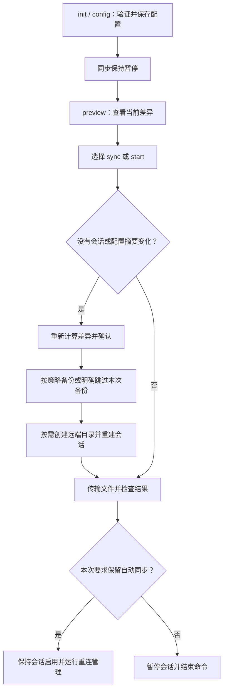

# 核心概念（Core Concepts）

devsync 把本地开发目录按规则同步到 Linux 开发机，让你在本地编辑源码、在远端运行项目。它提供配置、差异确认、备份和后台管理；实际的文件扫描与传输由 Mutagen 完成，连接使用 SSH。

本文以本地 `/path/to/app` 同步到 `alice@devbox:/home/alice/app` 为例，解释命令背后的行为。查具体写法可阅读[命令与参数](cli.md)，查 JSON 字段可阅读[配置与接口](configuration.md)。

## 本地来源与远端目标

一个 devsync 项目对应一个本地目录，以及个人配置中的一个远端目录。项目不需要 `package.json`，本地 Node.js 只用于运行 devsync。默认以执行命令时的当前目录为项目根目录；`--dir` / `-C` 可以指定另一个已存在的目录，不会向父目录自动寻找项目。

当前唯一的同步模式是 `one-way-replica`，即以本地为准的单向复制。在规则选中的范围内，结果如下：

| 本地与远端的差异 | 同步对远端的影响 |
| --- | --- |
| 本地新增 `src/app.js` | 在远端创建该文件 |
| 本地修改 `src/app.js` | 将远端文件更新为本地内容 |
| 本地删除 `src/old.js` | 删除远端对应文件 |
| 只有远端存在 `notes.txt` | 删除这个远端独有文件 |
| 两端同名文件内容不同 | 以本地内容覆盖远端内容 |
| `dist/` 被同步规则排除 | 该目录下的文件不参与上述复制、覆盖和删除 |

因此应为每个本地项目指定独占的远端开发目录。在远端手工修改已纳入同步的源码，后续可能被本地内容覆盖；远端编辑也不会自动回传到本地。Git 提交、切换分支和构建命令仍由你自己的开发流程执行。

## 同步范围由规则决定

项目根目录的 `sync.config.json` 回答“哪些文件参与同步”。缺少这个文件时使用默认规则：

```json
{
  "version": 1,
  "mode": "one-way-replica",
  "exclude": [".vscode", ".idea", ".DS_Store", "node_modules", "dist"],
  "envFiles": [],
  "pollingInterval": 1
}
```

理解规则时，需要掌握以下关系：

- `exclude` 是排除列表。显式设置会替换默认列表；例如只写 `["cache"]`，默认的 `node_modules` 和 `dist` 就不再被这份列表排除。
- `.sync`、`.git`、`.hg`、`.svn` 和根目录 `sync.config.json` 始终排除；清空 `exclude` 也会保留这些保护。
- `.env*` 默认排除。`envFiles` 只允许具体文件路径，例如 `"docker/.env"`；允许后，该文件的修改和删除都会同步。
- `.gitignore` 只决定 Git 的忽略范围。把文件加入 `.gitignore`，不会自动把它加入 devsync 的排除范围。
- `pollingInterval` 是本地扫描变化的间隔，单位为秒。实际同步耗时还取决于扫描、连接和传输，不能把它当作完成同步的时间保证。

例如远端自己生成的 `dist/` 想保留在远端，就应继续将它排除。以后从 `exclude` 中删除 `dist`，相当于扩大同步范围：远端这个目录也会按本地内容更新，远端独有文件可能进入删除清单。

本地预览、远端预览和 Mutagen 会话使用同一份规范化规则。支持的路径及通配符语法见[公共项目规则](configuration.md#公共项目规则)。

## 配置和状态分别放在哪里

devsync 将团队规则、个人连接和运行状态分开保存，团队成员可以使用同一份规则连接自己的开发机。

| 位置 | 回答的问题 | 使用范围 |
| --- | --- | --- |
| 项目 `sync.config.json` | 同步哪些文件、多久扫描一次？ | 可随业务项目提交 Git |
| 项目 `.sync/config.json` | 同步到哪台机器、哪个目录，用哪种备份策略？ | 当前用户的这个项目 |
| 项目 `.sync/auth.json` | 密码认证时使用什么密码？ | 项目私有；密钥认证时为空对象 |
| 项目 `.sync/` 中的其他记录 | 接受过什么配置，上次结果怎样，会话是否运行？ | 当前项目的运行状态 |
| 用户配置目录 `devsync/config.json` | 从哪里下载 Mutagen，是否使用下载代理？ | 同一用户的所有项目 |
| 用户配置目录 `devsync/projects.json` | 控制面板展示哪些项目？ | 同一用户的项目索引 |
| 用户缓存目录 `project-sync/mutagen/` | 已下载的程序存在哪里？ | 按版本与平台共享 |

`init/config` 会补充业务项目 `.gitignore` 中的 `.sync/` 排除项。密码保存在私有文件中，尚未接入系统钥匙串；团队共享的是规则文件。

`.sync/` 中几份常见记录的用途如下。日常操作通过命令完成即可，排查时再读取它们：

| 文件或目录 | 含义 |
| --- | --- |
| `accepted.json` | 已确认的配置摘要、备份范围和确认选择 |
| `preview.json` | 最近一次计算出的新增、覆盖、删除及备份计划 |
| `backups.json` | 本项目创建并登记的远端备份压缩包位置 |
| `control.json` | 后台重连管理的请求状态和进程信息 |
| `last-run.json` | 最近一次 `sync/start` 成功传输的时间和文件数 |
| `last-failure.json` | 最近一次被记录的 `sync/start` 失败详情 |
| `state/` | 项目独立的 Mutagen 会话和 daemon 数据 |

## 配置、预览、同步是三个步骤

`init` 和 `config` 使用同一个配置流程：暂停已有同步，收集并验证连接信息，确认后保存。`init` 通常用于首次接入，`config` 通常用于修改已有连接。保存配置后仍保持暂停；不存在的远端项目目录会等到实际同步时再创建。

`preview` 会暂停已有自动同步，然后读取两端文件清单，展示新增、覆盖和删除。它不修改远端源码，但会写本地预览记录。预览结束后需要执行 `sync` 或 `start` 才会恢复同步。

下面是一次成功操作的主要流程：



单独执行 `preview` 是便于检查的使用步骤。需要新确认时，`sync/start` 本身也会计算差异，不要求必须先手动运行 `preview`。

`sync` 通常执行一次后暂停。如果已有自动模式运行，且配置未变、原会话可复用，执行 `sync` 会立即同步并保持自动模式。需要重建会话时，`sync` 按单次同步结束；想确保后续持续同步，使用 `start`。`stop` 则停止当前项目的重连管理并暂停会话，保留配置和文件。

## 确认记录如何影响下一次同步

devsync 会把本地根目录、远端目标、规则、轮询设置和相关私钥传输配置生成一个摘要，称为“配置指纹”，保存在 `accepted.json` 中。创建会话时，需要确认将要使用的配置范围。

普通源码内容变化不会改变这个指纹，因此日常编辑无需反复确认。目标目录、排除规则等配置变化，或会话不存在时，`sync/start` 会重新展示差异并要求确认。保存 `init/config` 向导中的配置，只完成配置保存这一步。

`--yes` 表示接受本次同步命令需要的确认，命令仍执行连接验证和项目备份策略。先运行 `preview`，稍后再运行 `sync --yes` 时，若需要新确认，命令会重新计算差异；先前的 `preview.json` 不会锁定接下来必须执行的文件清单。

修改规则后，可以使用以下步骤检查影响并恢复持续同步：

```bash
devsync preview --dir /path/to/app
devsync start --dir /path/to/app
```

## 备份覆盖哪些文件

默认的 `backup.mode` 为 `auto`，`backup.keep` 为 `3`。备份主要保护首次接管和扩大同步范围时，即将被覆盖或删除的远端文件。

| 场景 | 默认自动备份的范围 |
| --- | --- |
| 首次接入，或切换本地来源、远端目标 | 当前会被覆盖或删除的远端文件 |
| 同一目标下扩大同步范围 | 新纳入范围且会被覆盖或删除的远端文件 |
| 只改变认证或轮询配置 | 不因此增加备份 |
| 日常源码编辑与后台同步 | 不逐次备份 |
| 没有需要保护的受影响文件 | 不生成空备份 |

需要备份时，归档失败会阻止同步。交互确认可以选择跳过本次备份；`--yes` 会沿用项目策略。备份压缩包存放在远端项目目录旁，`.sync/backups.json` 保存登记位置。同步成功后，才按保留策略清理当前项目、当前目标的登记备份。

这类备份只覆盖当时选中的文件，恢复时应先 `stop`，再把压缩包解到独立目录核对。具体策略和保留规则见[备份策略](configuration.md#备份策略)。

## 会话、后台管理与控制面板

理解“后台运行”时，可以区分以下三个角色：

| 角色 | 负责什么 | 生命周期 |
| --- | --- | --- |
| Mutagen 会话与 daemon | 保存同步关系，扫描和传输文件 | 启用的会话可在 CLI 退出后继续工作；暂停会话会停止同步 |
| devsync 重连管理进程 | 检查项目控制状态，断连后重试，处理密码重连 | `start` 启动，`stop` 停止 |
| `dashboard` 控制面板 | 展示已登记项目，调用配置、开启和停止操作 | 退出面板只关闭界面及查询 |

每个项目有独立的 `.sync/state/` 和重连管理进程。多个项目可以复用同一份 Mutagen 程序，但各自的会话和控制状态独立，停止项目 A 不会停止项目 B。为不同本地项目选择各自的远端目录，才能同时保持文件范围独立。

`start` 成功后关闭终端，后台同步仍可运行。电脑重启后需要再次执行 `start`，目前没有开机自启动。面板只读取已登记项目；移除面板记录不会删除项目，也不会停止同步。详情见[控制面板](dashboard.md)。

## 如何读懂状态与失败记录

运行 `devsync status` 时，应分别回答“后台管理是否运行”和“文件是否对齐”。命令读取本地记录与已有引擎快照，不会启动 daemon 或重新发起 SSH 验证。

| 字段 | 应如何理解 |
| --- | --- |
| `ok` | 本次命令是否返回了正常结果；状态查询成功仍可能包含同步错误 |
| `auto` / `manager` | 后台重连管理的请求与运行情况 |
| `sync.active` | 会话是否启用；启用不代表当前正在传输 |
| `sync.aligned` | `true` 表示引擎报告对齐；`false` 表示尚未对齐或有问题；`null` 表示当前无法确认 |
| `issues` / `actions` | 当前快照中的问题，以及建议执行的命令 |
| `lastRun` | 最近一次 `sync/start` 成功传输的记录，不记录每次后台传输 |
| `lastFailure` | 历史命令失败详情，和当前引擎状态分开解释 |

例如，`manager.state: running` 与 `sync.state: disconnected` 可以同时出现，表示后台管理正在运行但端点尚未连接。单次 `sync` 成功后会暂停会话，接着查询得到 `sync.aligned: null` 也合理：暂停期间没有重新确认两端文件是否仍然一致。

失败命令可能已同步了部分文件。`status` 和面板会保留并标注上次失败的阶段、原因及路径；成功传输后会清除旧失败记录，取消确认则保留历史记录。查看方式：

```bash
devsync status --dir /path/to/app
devsync status --dir /path/to/app --verbose
devsync status --dir /path/to/app --json
```

默认按原因分组并显示少量路径示例；`--verbose` 展示全部已记录详情，JSON 提供结构化数据。引擎已经省略的路径只能展示数量。完整字段含义见[CLI 输出契约](configuration.md#cli-输出契约)。

## 从概念找到源码

| 想理解的部分 | 建议阅读 |
| --- | --- |
| 命令与参数怎样进入程序 | [commands.mjs](../src/commands.mjs)、[cli.mjs](../src/cli.mjs) |
| 配置、预览、确认和同步怎样串起来 | [service.mjs](../src/service.mjs) 中的 `ProjectSync` |
| 文件为什么被包含或排除 | [rules.mjs](../src/rules.mjs) |
| 为什么本次需要备份 | [backup.mjs](../src/backup.mjs) |
| 怎样驱动 Mutagen，以及如何后台重连 | [session.mjs](../src/session.mjs)、[worker.mjs](../src/worker.mjs) |
| 当前状态与历史失败怎样展示 | [status.mjs](../src/status.mjs)、[diagnostics.mjs](../src/diagnostics.mjs) |
| Tab 补全怎样生成和安装 | [completion.mjs](../src/completion.mjs) |

首次使用可以继续阅读[命令与参数](cli.md)，再按[配置与接口](configuration.md)调整项目。参与开发可以接着阅读[架构与流程](architecture.md)和[开发与测试](development.md)。
